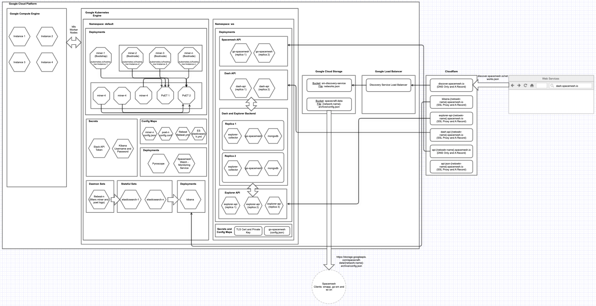
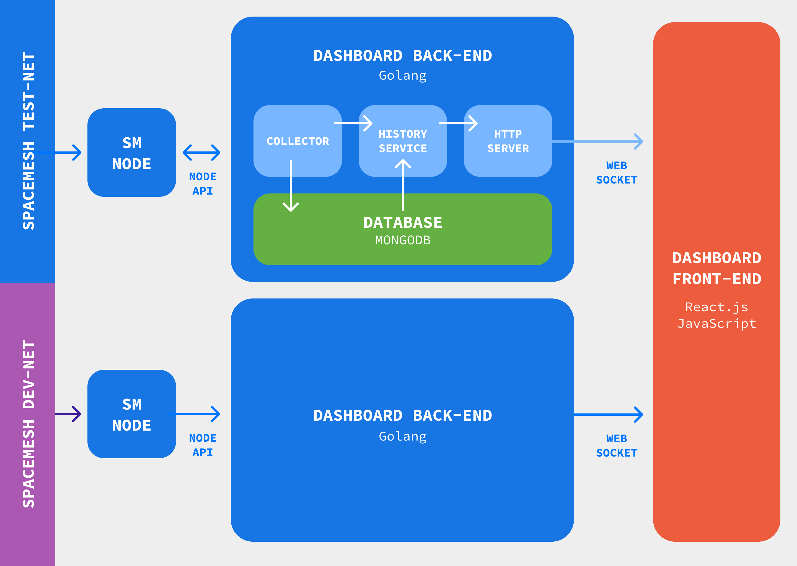
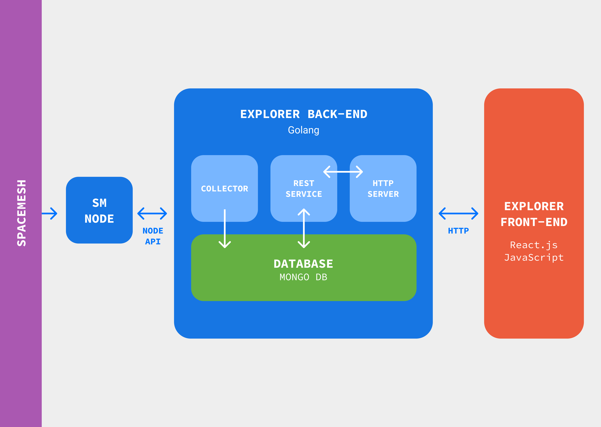
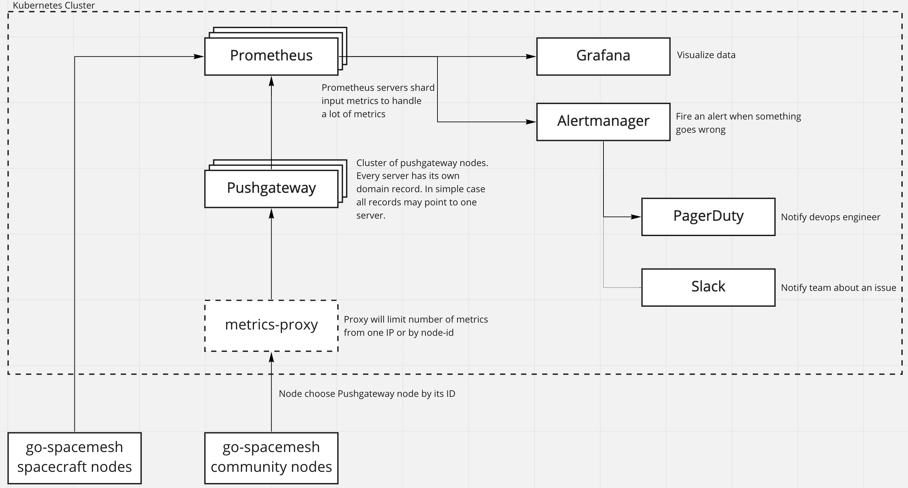

# Spacecraft

Spacecraft is a CLI tool which lets you deploy Spacemesh networks in GCP. It uses kubernetes REST APIs and Helm charts for deployment of different services. 

Features supported by spacecraft are the following: 

- create a new network
- add miner to existing network
- delete a miner from an network
- upgrade config or spacemesh release of a network
- create a network without bootstrap i.e., it doesn't deploy a bootstrap node and instead connects to an existing network.
- calculate rewards of a network
- deploy web services for a network.

Here is an high level architecture of a complete network deployed on GCP using spacecraft:



## Service Integrations

Spacecraft integrates with mainly 3 different services: GCP, Cloudflare, and Slack. In GCP it uses kubernetes engine, cloud storage, and load balancer. 

It creates a new kubernetes cluster for every new network, and stores the network's [go-spacemesh](https://github.com/spacemeshos/go-spacemesh) config file in cloud storage. 

The discovery service ([https://discover.spacemesh.io/networks.json](https://discover.spacemesh.io/networks.json)) is already hosted on cloud storage and served as static site through load balancer. For every new network deployment, spacecraft only updates the discovery service networks list file stored in cloud storage.

Cloudflare is used for creating domain name records for every new network. the records point to various services deployed in kubernetes engine. Our cloudflare account is already configured with [spacemesh.io](http://spacemesh.io) nameservers therefore spacecraft can create the sub-domain records in it. Spacecraft currently doesn't allow us to provide root domain name as CLI option. It has spacemesh.io root domain hardcoded. 

## ENVs and Secrets

To use spacecraft you need to have the following ENVs set:

```jsx
# GCP Authentication

SPACECRAFT_GCP_PROJECT=
SPACECRAFT_GCP_LOCATION=
SPACECRAFT_GCP_ZONE=
GOOGLE_APPLICATION_CREDENTIALS=

# Cloudflare Authentication

SPACECRAFT_CLOUDFLARE_API_TOKEN=

# Slack Authentication

SPACECRAFT_SLACK_CHANNEL_ID=
SPACECRAFT_SLACK_TOKEN=

# SSL Cert and Key

SPACECRAFT_TLS_CRT=
SPACECRAFT_TLS_KEY=
```

If you don't want slack alerts or if you don't want to deploy web services then you can omit the slack and SSL ENVs respectively. 

## Using the CLI

You can download and compile spacecraft using the following commands:

```jsx
git clone git@github.com:spacemeshos/go-spacecraft.git
cd go-spacecraft && go build
```

Now you can explore the CLI flags and sub-commands using:

```jsx
./go-spacecraft --help
```

Now you can refer to [devnet deployment guide](docs/devnet.md) to understand how to use the CLI to deploy a new network and web services.

## Network Deployment

For creating a new network boostrap deploys one bootstrap node, multiple bootnodes and then multiple miners. The bootnodes connect to bootstrap for p2p discovery and miners connect to bootnodes for p2p discovery. 

Spacecraft also allows you to create a network that actually extends another network i.e., deploys a network without bootstrap. In this case the bootnodes connect to the bootnodes of the other network and miners of this new network connect to the bootnodes of this new network. This can be useful when you want to delete all the managed miners and other deployments and create a fresh network that connects to an existing network. You can achieve this using the `--bootstrap=false` flag.

Whenever a network is created it also deploys a N number of PoETs. The number of poets can be specified using CLI option.  The PoET are assigned to the nodes in round robin fashion using `poet-server` config of go-spacemesh. The first node is then added to the config file so home smeshers use the first PoET always. 

The bootnodes are always tied to a particular k8s worker node in round robin fashion. There are mainly two reasons for doing this: 

- Firstly if we don't do this then its possible k8s will host multiple bootnodes in one k8s worker node and if that VM crashes then all bootnodes are down and new smeshers cannot join the network.
- Secondly the TCP port of the bootnodes needs to be bind'ed to the host node otherwise p2p discovery fails. p2p discover doesn't work over k8s NodePort service. Therefore if we don't bind bootnodes to host node then the k8s node in which the bootnodes are hosted can be rescheduled and therefore the IP to reach the bootnodes will change and smeshers will not be able to connect to the all or some bootnodes.

Spacecraft calculates the total number of k8s nodes need to be created dynamically based on total pods and their resource size. 

The GRPC and JSON API ports of all the managed miners are exposed as separate NodePort. You can get list of all the managed miners GRPC URLs using the `hosts` sub-command.

## Logs

Spacecraft deploys ELK stack for aggregation of logs. It uses filebeat to collect logs and directly stores them in Elasticsearch. All the fields in the logs are converted to string and non-JSON logs are stored raw. There is no logstash deployed because logstash is slow at processing logs instead it uses filebeat logs processing scripts which can process logs  in parallel and very fast.

To deploy filebeat, elasticsearh and kibana it uses helm charts by elastic ([https://github.com/elastic/helm-charts](https://github.com/elastic/helm-charts)).

## Monitor and Alerts

Spacecraft deploys spacemesh-watch ([https://github.com/spacemeshos/spacemesh-watch](https://github.com/spacemeshos/spacemesh-watch)) service which uses GRPC API of the managed miners to monitor them. And when some issue is detected it send alerts in slack. 

## Pyroscope

Pyroscope is an continuous profiling platform. Spacecraft also deploys pyroscope for debugging performance related issues of miners. Pyroscope doesn't support horizontal scaling therefore we cannot collect data of all the miners so we only collect data of miner-10 and miner-20. In code it's hardcoded to collect data from these two miners only.

## Web Services

Web services for a network is basically combination three things: dashboard, explorer and spacemesh public API.

The dashboard and explorer frontend are already deployed in GCP storage and served as static website as load balancer. The dashboard and explorer backends needs to deployed separately for every network. The dashboard and explorer frontends looks for list of deployed networks in [discover.spacemesh.io/networks.json](http://discover.spacemesh.io/networks.json) file and allows the user to select a network via a dropdown.

In spacecraft, when web services are deployed it updates the networks.json file with the information about the new network. The [discover.spacemesh.io/networks.json](http://discover.spacemesh.io/networks.json) file is hosted in GCP storage and served as static website using GCP load balancer.

Currently web services aren't automatically deployed when a network is deployed instead you need to run the `deployWS` sub-command to deploy the web services. 

For deploying web services, spacecraft uses the ws-helm-charts ([https://github.com/spacemeshos/ws-helm-charts](https://github.com/spacemeshos/ws-helm-charts)). 

It deploys the dashboard backend and explorer backend as multiple replicas for higher availability. It also deploys explorer collector as multiple replicas for higher availability. The spacemesh public API is also deployed as multiple replicas. 

Here is high level architecture diagram of the dashboard backend components and their interactions:



Here is high level architecture diagram of the explorer backend components and their interactions:



Cloudflare is used as SSL proxy and for domain records for spacemesh public JSON API, explorer backend API and dashboard backend API. Whereas for spacemesh public GRPC API, k8s Ingress  is used as SSL proxy and cloudflare is used only for DNS record. The reason we do this for GRPC API is because cloudflare is not capable to proxy GRPC connections currently. Due to this we store SSL cert and key in secrets.

## Metrics

If the `--metrics` flag is set during network deployment then prometheus and grafana is deployed to collect metrics. Prometheus and grafana is deployed using helm charts. These are deployed in `metrics` namespace. 

Here is the architecture of the deployment:



The managed miners will start to push metrics to prometheus. The grafana URL is printed after the network is deployed.
